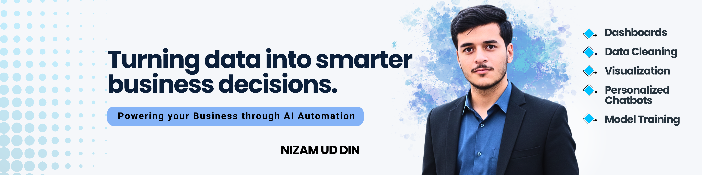

<!-- ================================================= -->
<!--                  PROFILE BANNER                  -->
<!-- ================================================= -->

  

  <strong>Dashboards | Data Cleaning | Data Visualization</strong> 
  AI Integration | Personalized Chatbots

---

## 🚀 About Me

- 📊 **Data cleaning & transformation** for reliable analytics  
- 📈 **Dashboards & visual storytelling** for decision-makers  
- 🤖 **Personalized AI chatbots** & ML-powered solutions  
- 🧠 Strong focus on **clarity, performance, and real-world impact**

---

## 🧠 Core Skills

  
  
  
  
  

---

## 🛠️ Tools & Technologies

### Data · ML · AI

  
  
  
  
  
  

### Productivity · Design

  
  
  
  

---

## 🎓 Certifications
 
🔗 https://www.linkedin.com/in/nizamuddinraqeeb

- Business Analytics with Excel
- Advance Python Programming
- Prompt Engineering
- Generative AI
- Git and Github 

---

## 📊 GitHub Performance

  

  

---

## 🌐 Connect With Me

  
  
  
  

---

  <em>Turning Data into Smarter Business Decisions.</em>

